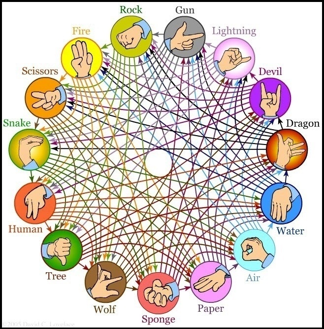

# Advanced Rock Paper Scissors Project in vanilla JavaScript

## This is a base model project, created with intention to translate it in the future to React and React Native to mobile app

This is my first semi-serious project, where I didn't follow any tutorials from YT and just try to make it as best I can do at the moment.

## What this app will do?

It is a advanced version of Paper Rock Scissor Game, where to standard three option, I've added 12 new option to chose from during game. It might be played as standard game (against computer oponent) or simply just as a guide if you want to play that game in real life.
I've based my idea and take icons from this image I've found on the internet:

made by <a href='https://twitter.com/hamsterdunce' target='_blank'>David C. Lovelace</a>

My roadmap to this project looks like that:

- v0.1 functional desktop version of app (we are here)
- v0.2 mobile browser version
- v0.3 option of playing with computer
- v0.4 3 different modes of game to choose from
- v0.5 Day/Night Mode interface
- v0.6 Player vs Player Mode
- v0.7 Add Difficulty Levels for playing with computer
- v0.8 Add sound effects
- v0.9 Fix any problems, that might happend in the meantime
- v1.0 Final version

## How to use it?

1. Clone this project
2. Open index.html using your browser
3. Click on the icon/card of your chosing. It will show up what option you beat with your icon (green) and which one will beat you (red).
4. Context menu on the right will help you if you are confused by UI or are colorblind

## How to actually play that game (when it will be playable)?

1. Click the card on the wheel
2. In the window below you should see the icon of your choosing
3. Confirm your choice by cliking 'Done'
4. 1 If you playing against computer, the computer will make a turn
5. 2 If you playing against player, your conformed option should hide. Now it's time for the other player to make a turn
6. Whatever you play against computer, or another player, after both choices are made, the match has begun.
7. <b>For each win player get 1 points, and for each lost match, you lose 1</b>
8. Both of players starts with 0 points. Player who get 3 points first will win.
9. None of players can have less than 0 points.
